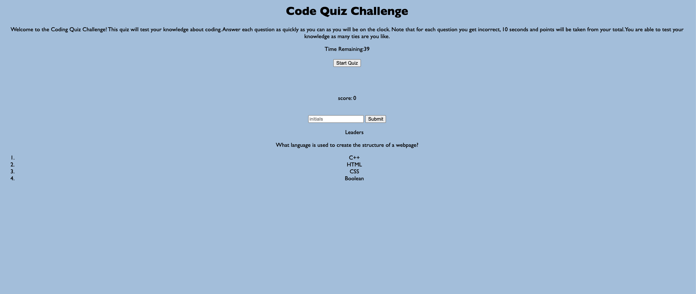

# code-quiz

A timed quiz on JavaScript fundamentals that stores high scores
SO THAT I can gauge my progress compared to my peers

[LIVE SITE](https://hreichgelt.github.io/code-quiz/)

## TABLE OF CONTENTS

1. [Description](#description)
2. [Usage](#USAGE)
3. [Visuals](#visuals)
4. [Authors Acknowledgments](#authors-and-acknowledgments)
4. [Resources](#resources)

## DESCRIPTION 
This is a timed coding quiz. When start is clicked questions will show on the body of the webpage. There will be four possible answers to each question. The user will have 50 seconds.
If the user selects a wrong answer time will be deducted from the clock. Users will be prompted about the status of each answer (right or wrong).  

## USAGE 
Please read the directions carefully. You will have 50 seconds to answer a series of coding related questions. When you click start quiz, the timer will start running. Questions and possible answers will show towards the body of the page. click on te potential answer you feel is correct. When all of the questions have been answered or the timer reaches zero, you will be prompted that the quiz is over. When that happens, please enter your initials to save into local storage. It will store each games scores so you can track high-scores. 

## VISUALS 

## AUTHORS AND ACKNOWLEDGMENTS
Hans Reichgelt
Instructional Staff for coding bootcamp
John Titus - Tutor

## RESOURCES 
1. [LIVE SITE](https://hreichgelt.github.io/code-quiz/)

2. [REPOSITORY](https://github.com/Hreichgelt/code-quiz)

